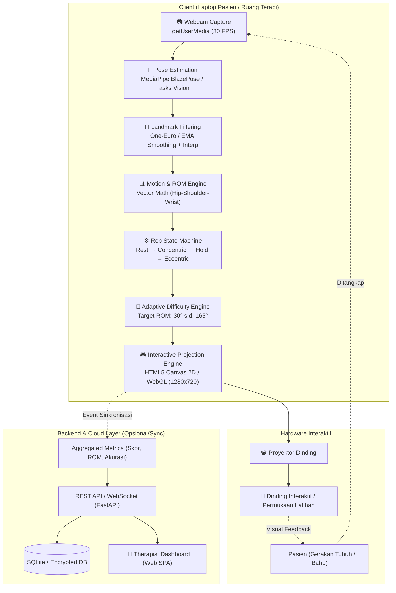
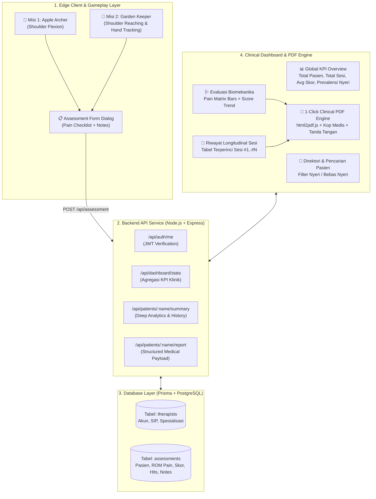

# MoveWall AI — System Architecture & Mission 1 Archer Character Upgrade

## Ringkasan Eksekutif

Dokumentasi ini merangkum pemahaman arsitektur sistem **MoveWall AI** (sistem tele-rehabilitasi interaktif berbasis Computer Vision dan proyeksi dinding) serta implementasi perombakan visual dan fisik pada **karakter pemanah (Archer)** di **Misi 1: Apple Archer** (`game-ui/app.js`).

---

## 1. Arsitektur Sistem MoveWall AI

Sistem MoveWall AI dirancang dengan prinsip **Edge-First Computation**, di mana pemrosesan video dan inferensi biomekanika berjalan 100% di sisi klien (komputer pasien/klinik), sehingga menjaga privasi dan latensi minimal (<33ms @ 30 FPS).



### Komponen Utama Arsitektur:

1. **Computer Vision & Kinematic Pipeline (`edge_pipeline.py`)**:
   - **`landmark_filter.py`**: Melakukan temporal filtering (One-Euro / EMA filter) untuk meredam jitter landmark tanpa menambah lag, serta interpolasi short-term jika terjadi oklusi sementara (grace period hingga 15 frame).
   - **`angle_calculator.py`**: Menghitung sudut anatomis sendi secara deterministik. Pada Misi 1 (Shoulder Flexion / Elevasi), sudut dihitung dari vektor *shoulder-hip* terhadap vektor *shoulder-wrist*, dilengkapi koreksi rasio aspek kamera.
   - **`rep_state_machine.py`**: Mengontrol siklus repetisi terapi: `REST` $\rightarrow$ `CONCENTRIC` $\rightarrow$ `HOLD` (verifikasi tahanan 2,0 detik pada sudut target) $\rightarrow$ `ECCENTRIC` $\rightarrow$ `COMPLETED`.
   - **`adaptive_engine.py`**: Menyesuaikan tingkat kesulitan secara adaptif berdasarkan kualitas gerakan (smoothness, compensation, hold stability).

2. **Interactive Projection Layer (`game-ui/`)**:
   - Menggunakan kanvas resolusi tinggi yang diproyeksikan ke dinding.
   - **Misi 1 — Apple Archer**: Pasien mengangkat lengan untuk membidik apel virtual di dahan pohon pada sudut ROM target (Level 1: 30°, 45°, 60°, 75°, 90°; Level 2: 105°, 120°, 135°, 150°, 165°).
   - **Misi 2 — Restore the Garden**: Pasien meraih pot tanaman untuk menyiram tanaman pada berbagai koordinat ketinggian dinding.

---

## 2. Perubahan Karakter pada Misi 1 (Apple Archer)

Karakter pemanah sebelumnya digambar dengan bentuk garis dan poligon kaku (tongkat datar, tanpa anatomi alami, tanpa perlengkapan memanah). Telah dilakukan **perombakan total (visual, animasi, proporsi, dan perlengkapan)** pada fungsi `drawArcher()` di [game-ui/app.js](file:///c:/Users/ASUS/Documents/gitmovewall/game-ui/app.js):

### A. Animasi Pernapasan & Dinamika Angin (Breathing & Idle Sway)
- Ditambahkan pernapasan dinamis sinusoidal (`Math.sin(t * 0.0028)`) yang membuat dada, bahu, dan kepala bergerak naik-turun halus secara natural.
- Ditambahkan ayunan angin halus pada ujung bulu topi dan jubah pemanah selaras dengan dedaunan kebun apel.

### B. Anatomi & Postur Memanah Atletis (Archer Stance)
- **Kaki Belakang (Left Leg)**: Kaki penopang dengan paha dan betis berkontur celana ranger kelabu gelap (`#1b2938`), ditekuk stabil menahan tarikan busur.
- **Kaki Depan (Right Leg)**: Kaki tumpuan depan yang kokoh menghadap target apel.
- **Sepatu Bot Kulit (Leather Boots)**: Dilengkapi lipatan kerah bot (*turnover cuffs*) cokelat tua dan sol yang menapak di tanah dengan bayangan kontak (*ground contact shadow*).

### C. Kostum Ranger & Perlengkapan Memanah
- **Tunic & Rompi**: Jubah ranger hijau zamrud berpola gradien (`#1d472c` ke `#275e3a`) dengan bordir emas di kerah dan keliman, dipadukan rompi kulit (*leather jerkin*) berkancing tali silang.
- **Sabuk & Pouch**: Sabuk kulit lebar dengan gesper kuningan poles serta kantong utilitas (*utility pouch*) di pinggul.
- **Quiver & Anak Panah**: Tabung anak panah kulit bersabuk selempang diagonal melintasi dada dengan cincin kuningan. Dari atas tabung mencuat 3 anak panah dengan bulu fletching rapi (merah, emas, hijau) di belakang punggung.

### D. Wajah & Topi Robin Hood / Ranger
- **Ekspresi Wajah Fokus**: Profil rahang dan dagu yang tegas, mata berfokus tajam menatap lurus ke arah target apel, serta alis miring konsentrasi.
- **Topi Berbulu (Bycocket Cap)**: Topi pemanah klasik warna hijau dengan pinggiran belakang melengkung ke atas, dihiasi bulu plume panjang (putih & merah marun) yang melambai tertiup angin.

### E. Lengan, Vambrace & Kinematika Busur
- **Bow Arm (Lengan Depan Pembidik)**: 
  - Elevasi sendi bahu bergerak dinamis mengikuti sudut ROM pasien (`game.controlAngle`) dari 0° hingga 165°.
  - Dilengkapi **Vambrace / Arm-Guard kulit** dengan pelat pelindung dan tali gesper kuningan untuk melindungi lengan dari benturan tali busur.
- **Draw Arm (Lengan Belakang Penarik Tali)**:
  - Siku ditarik tinggi ke belakang dengan sarung jari (*shooting tab*) yang menahan tali busur di dekat pipi/dagu (*anchor point* alami).
  - Saat menahan target (`holdRatio`), tangan penarik mundur lebih dalam menciptakan ketegangan fisik.
- **Recurve Bow & String**:
  - Busur kayu berlaminasi dengan lekukan recurve realistis dan nock tanduk di ujungnya.
  - Saat posisi *hold*, kedua ujung busur melengkung ke dalam menahan beban regangan (*limb flex*).
  - Tali busur ditarik membentuk sudut V tajam tepat di tangan penarik.
- **Anak Panah pada Busur**:
  - Anak panah kayu cedar menempel pada *arrow shelf* di gagang busur, membentang dari tangan penarik maju menembus busur dengan mata panah baja bodkin mengkilap yang mengarah tepat ke target apel.

### F. Integrasi Kinematika Tembakan & Guide
- Fungsi `getBowGripNorm()` ditambahkan agar lintasan proyeksi panah (`fireArrowAtTarget`) dan garis pandu bidikan (`drawReachGuide`) bermula tepat dari genggaman busur pemanah, bukan dari titik statis.

---

## 3. Checklist Task yang Diselesaikan

- [x] **Mempelajari Arsitektur Sistem**: Analisis mendalam terhadap pipeline Edge CV (`edge_pipeline.py`, `landmark_filter.py`, `angle_calculator.py`, `rep_state_machine.py`, `adaptive_engine.py`) dan Game Projection Layer (`game-ui/`).
- [x] **Perombakan Visual Karakter Misi 1**: Mengganti karakter stickman/poligon sederhana dengan karakter pemanah berbusur recurve lengkap, jubah ranger, topi bulu, tabung panah, dan vambrace pelindung lengan.
- [x] **Animasi & Fisika Responsif**: Implementasi animasi napas idle, dinamika angin, lekukan elastis busur saat ditarik (*hold tension*), serta hentakan balik tali panah saat lepas (*release recoil*).
- [x] **Penyelarasan Kinematika Bidikan**: Koordinasi antara sudut ROM bahu pasien dengan sudut elevasi lengan busur dan titik lepas anak panah.
- [x] **Perbaikan Anomali Background**: Menghapus artefak elips bayangan/highlight putih kabur (`drawSceneDepth`) yang melayang di atas pohon apel latar belakang dan memastikan efek kedalaman prosedural hanya aktif jika background gambar referensi tidak tersedia.
- [x] **Verifikasi Browser & Visual Inspection**: Pengujian live di peramban tanpa error konsol dan validasi tangkapan layar tampilan kanvas.
- [x] **Pembaruan Walkthrough & Dokumentasi Task**: Penyusunan arsitektur sistem dan detail perubahan teknis pada file walkthrough ini.

---

## 4. Perbaikan Anomali Background (Translucent Canopy Ellipse)

### Masalah yang Ditemukan:
Pada tampilan background kebun apel, terlihat sebuah bayangan lonjong/elips putih transparan yang melayang di atas dahan pohon apel sebelah kanan (seperti noda/kabut abu-abu).

### Penyebab:
Fungsi `drawSceneDepth()` di `game-ui/app.js` semula dirancang untuk kanvas prosedural fallback (sebelum adanya foto background realistis). Di dalamnya terdapat pemanggilan elips statis:
```javascript
ctx.fillStyle = "rgba(255, 255, 255, 0.16)";
ctx.ellipse(width * 0.78, height * 0.37, width * 0.23, height * 0.13, -0.08, 0, Math.PI * 2);
```
Fungsi ini sebelumnya dipanggil tanpa memeriksa `hasReferenceScene`, sehingga elips tersebut digambar menimpa gambar background realistis.

### Solusi:
1. Menghapus elips statis tersebut dari `drawSceneDepth()`.
2. Memasukkan pemanggilan `drawSceneDepth(width, height)` ke dalam blok `if (!hasReferenceScene)` di fungsi `draw()`, sehingga saat gambar referensi `orchardBackground` aktif, tidak ada efek prosedural yang menimpa kejernihan gambar asli.

---

## 5. Hasil Verifikasi Visual

Tampilan kanvas setelah perombakan karakter dan perbaikan anomali background:


### Catatan Pengujian:
- **Status Server**: Berjalan lancar di `http://localhost:3000`.
- **Background**: Bersih, alami, tanpa artefak/noda kabut transparan di atas pohon.
- **Error Konsol**: 0 error (bersih).
- **Interaksi Kamera & Bidikan**: HUD ROM meter, reticle pengarah sudut, dan elevasi busur bergerak responsif dan proporsional.

---

## Task_2: Therapist Assessment System

### Ringkasan Perubahan

Tiga fitur baru berhasil diimplementasikan:

1. **Halaman Login Therapist** (`game-ui/login.html`) — Entry point baru sistem
2. **Assessment Form Dialog** — Pop-up form di akhir setiap misi (Mission 1 & 2)
3. **Backend API** (`game-ui/backend/`) — Node.js + Express + Prisma ORM + PostgreSQL

---

### Backend Architecture (`game-ui/backend/`)

#### File yang Dibuat:

| File | Deskripsi |
|------|-----------|
| `server.js` | Express server dengan semua API endpoints |
| `prisma/schema.prisma` | Prisma schema dengan model Therapist & Assessment |
| `package.json` | Dependencies: express, prisma, bcryptjs, jsonwebtoken, cors |
| `.env` | Dummy PostgreSQL URI + JWT secret |

#### API Endpoints:

| Method | Path | Auth | Deskripsi |
|--------|------|------|-----------|
| `GET`  | `/api/health` | — | Health check |
| `POST` | `/api/auth/login` | — | Login terapis |
| `POST` | `/api/auth/register` | — | Registrasi terapis |
| `GET`  | `/api/auth/me` | JWT | Ambil data terapis login |
| `POST` | `/api/assessment` | JWT | Simpan assessment pasien |
| `GET`  | `/api/assessments` | JWT | List semua assessment terapis |
| `GET`  | `/api/assessment/:id` | JWT | Detail assessment |
| `POST` | `/api/dev/seed` | — | Seed dummy therapist |

#### Prisma Schema:

**Therapist** (tabel `therapists`):
- `id`, `name`, `username` (unique), `password` (bcrypt hashed)
- `email`, `specialization`, `licenseNumber`, `phoneNumber`
- `role` (enum: USER / THERAPIST), `isActive`, `createdAt`, `updatedAt`

**Assessment** (tabel `assessments`):
- `id`, `therapistId` (FK)
- `patientName`, `patientAge`
- `painAbduction`, `painFlexion`, `painExternalRotation`, `painInternalRotation`, `painExtension` (Boolean)
- `notes` (optional text)
- `missionId`, `sessionScore`, `sessionHits`, `sessionLevel`, `sessionTime`
- `createdAt`

#### Cara Menjalankan Backend:
```bash
cd game-ui/backend
npm install
# Pastikan PostgreSQL berjalan & update DATABASE_URL di .env
npx prisma migrate dev --name init
node server.js
# POST /api/dev/seed  untuk seed dummy therapist01 / movewall2026
```

---

### Login Page (`game-ui/login.html`)

**Desain Premium Glassmorphism:**
- Background animasi dengan 3 orbs berwarna (biru, hijau, ungu) yang bergerak floating
- Grid pattern subtle overlay
- Card glassmorphism dark dengan blur backdrop
- Input fields dengan icon, toggle show/hide password
- Error alert dengan animasi shake, success alert dengan redirect otomatis
- Demo credentials ditampilkan di footer card

**Alur Auth:**
1. Buka sistem → diredirect ke `login.html` (jika belum ada `mw_token` di sessionStorage)
2. Input username + password → `POST /api/auth/login`
3. Sukses → simpan JWT token + therapist info ke `sessionStorage`
4. Redirect ke `index.html` (Mission 1)

**Dummy Credentials (setelah seed):**
- Username: `therapist01`
- Password: `movewall2026`

---

### Assessment Form Dialog — Mission 1 & 2

**Fields yang Ada:**

| Field | Type | Required |
|-------|------|----------|
| Nama Lengkap Pasien | Text input | Ya |
| Usia Pasien | Number input (1–120) | Ya |
| Nyeri Fleksi Bahu | Checkbox | Tidak |
| Nyeri Abduksi Bahu | Checkbox | Tidak |
| Nyeri Rotasi Eksternal | Checkbox | Tidak |
| Nyeri Rotasi Internal | Checkbox | Tidak |
| Nyeri Ekstensi Bahu | Checkbox | Tidak |
| Catatan Terapis | Textarea | Tidak (opsional) |

**Alur Assessment:**
1. Misi selesai → muncul Mission Complete overlay
2. Klik tombol **"Isi Assessment"** (hijau) di overlay
3. Assessment form modal muncul dengan animasi slide-in
4. Badge terapis (dari sessionStorage) ditampilkan di atas form
5. Isi form → klik **"Simpan Assessment"**
6. Loading state → `POST /api/assessment` dengan JWT token
7. Sukses → tampil animasi ✅ success state
8. Data tersimpan ke PostgreSQL via Prisma

**UX Detail:**
- Close dengan tombol ✕, tombol Batal, atau klik backdrop
- Scroll form jika konten panjang (max-height 90vh)
- Custom checkbox dengan visual check mark saat dipilih
- Card checklist berubah warna merah muda saat nyeri dicentang
- Validation inline sebelum submit

---

### File yang Diubah/Dibuat:

| File | Status | Perubahan |
|------|--------|-----------|
| `game-ui/backend/server.js` | ✅ BARU | Express API server |
| `game-ui/backend/prisma/schema.prisma` | ✅ BARU | Prisma schema |
| `game-ui/backend/package.json` | ✅ BARU | Backend dependencies |
| `game-ui/backend/.env` | ✅ BARU | Database URI + JWT secret |
| `game-ui/login.html` | ✅ BARU | Halaman login therapist |
| `game-ui/index.html` | ✅ MODIFIKASI | + tombol assessment + modal assessment |
| `game-ui/mission2.html` | ✅ MODIFIKASI | + tombol assessment + modal assessment |
| `game-ui/app.js` | ✅ MODIFIKASI | + auth guard + assessment dialog logic |
| `game-ui/mission2.js` | ✅ MODIFIKASI | + auth guard + assessment dialog logic |
| `game-ui/styles.css` | ✅ MODIFIKASI | + login page styles + assessment modal styles |

---

## 6. Task_3: Therapist Admin Dashboard & Patient PDF Reporting System

### Ringkasan Eksekutif Task 3

Pada Task 3, sistem MoveWall AI dilengkapi dengan **Portal Dashboard Admin & Analitik Klinis Terapis** (`game-ui/dashboard.html`) serta generator **Laporan Rekam Medis PDF per Pasien** berstandar klinis rumah sakit/rehabilitasi medik.

Fitur ini memungkinkan terapis untuk:
1. Memantau performa dan perkembangan pemulihan pasien dari sesi ke sesi secara longitudinal.
2. Menganalisis korelasi keluhan nyeri sendi bahu (*Shoulder ROM Pain Checklist*) terhadap rentang gerak (abduksi, fleksi, rotasi internal/eksternal, ekstensi).
3. Mengekspor dokumen rekam medis resmi dalam format PDF siap cetak dengan satu kali klik.

---

### Diagram Alur Data & Arsitektur Sistem Lengkap



---

### Komponen Utama Dashboard Admin (`game-ui/dashboard.html` & `dashboard.js`)

#### A. Global KPI Overview Cards
- **Total Pasien Aktif**: Menghitung jumlah pasien unik yang terdaftar dan menjalani sesi bersama terapis.
- **Total Sesi Latihan**: Total sesi rehabilitasi yang berhasil diselesaikan, dilengkapi rincian distribusi Misi 1 (Archer) vs Misi 2 (Garden).
- **Rata-Rata Skor Sesi**: Rata-rata skor latihan seluruh sesi dan akurasi rata-rata hits/target per sesi.
- **Prevalensi Nyeri ROM**: Persentase sesi latihan yang mendeteksi keluhan rasa nyeri pada salah satu gerakan bahu, beserta jumlah sesi bebas nyeri (*pain-free sessions*).

#### B. Direktori & Pencarian Pasien Real-Time
- Input pencarian interaktif untuk menemukan pasien berdasarkan nama.
- Filter cepat: *Semua*, *Keluhan Nyeri*, dan *Bebas Nyeri*.
- Avatar inisial dengan badge usia dan jumlah sesi selesai.

#### C. Analisis Mendalam Pasien (Selected Patient Workspace)
- **Header Banner Pasien**: Menampilkan nama lengkap, usia, total sesi, rentang periode latihan, dan tombol aksi utama **"Unduh Laporan PDF"**.
- **Quick Stat Tiles**: Rata-rata skor, skor tertinggi (personal best), rata-rata target hits, tingkat keberhasilan adaptif, dan frekuensi nyeri.
- **Checklist Nyeri per Gerakan ROM**: Visualisasi batang status berkode warna (Hijau: 0% bebas nyeri; Kuning: 1–50%; Merah: >50% nyeri menetap) untuk 5 gerakan anatomis:
  1. *Fleksi Bahu (Shoulder Flexion / Elevasi Sagital)*
  2. *Abduksi Bahu (Shoulder Abduction / Elevasi Koronal)*
  3. *Rotasi Eksternal Bahu (External Rotation)*
  4. *Rotasi Internal Bahu (Internal Rotation)*
  5. *Ekstensi Bahu (Shoulder Extension)*
- **Progresivitas Skor Sesi**: Grafik batang horizontal yang memetakan skor setiap sesi secara berurutan, level kesulitan yang dicapai, dan hits akurasi.
- **Tabel Riwayat Longitudinal**: Rekam jejak setiap sesi secara kronologis mundur (sesi terbaru di atas) mencakup tanggal, waktu, nama misi, tingkat level, target hits, skor poin, tag keluhan nyeri yang terdeteksi, dan catatan klinis terapis.

---

### Generator Laporan PDF Pasien (`html2pdf.js`)

Laporan PDF dirancang dengan layout kop medis resmi A4 siap cetak:
1. **Kop Surat Resmi Medis**: *MOVEWALL AI CLINICAL REPORT* lengkap dengan ID Rekam Medis unik (`MW-xxxxxx`), tanggal cetak, dan status rekam terverifikasi.
2. **Identitas Pasien & Terapis**: Nama pasien, usia, total sesi, periode latihan, nama terapis penanggung jawab, spesialisasi, dan nomor lisensi/SIP.
3. **Ringkasan Eksekutif & Toleransi Latihan**: Matriks rata-rata skor, skor tertinggi, akurasi hits, dan prevalensi rasa sakit.
4. **Tabel Evaluasi Nyeri per Gerakan ROM**: Rekapitulasi jumlah insidensi nyeri per gerakan sendi bahu beserta status toleransi klinis (*Optimal*, *Cukup Baik*, atau *Terganggu*).
5. **Log Kronologis Seluruh Sesi**: Tabel lengkap sesi latihan beserta level, target hits, skor, status nyeri, dan catatan evaluasi terapis.
6. **Rekomendasi Terapi & Blok Tanda Tangan**: Kolom anjuran tindak lanjut klinis serta kolom tanda tangan basah/digital dan stempel terapis.

---

### Endpoint Backend Baru (`game-ui/backend/server.js`)

| Method | Endpoint | Auth | Deskripsi |
|---|---|---|---|
| `GET` | `/api/dashboard/stats` | JWT | Menghasilkan ringkasan agregat klinik: total pasien, total sesi, distribusi misi, rata-rata skor & hits, serta frekuensi keluhan nyeri ROM. |
| `GET` | `/api/patients` | JWT | Mengambil daftar nama pasien unik beserta usia, tanggal sesi terakhir, dan jumlah sesi. |
| `GET` | `/api/patients/:name/summary` | JWT | Menghasilkan analitik mendalam pasien tertentu: profil, metrik skor/hits, breakdown nyeri per gerakan, dan riwayat sesi kronologis. |
| `GET` | `/api/patients/:name/report` | JWT | Menyediakan payload rekam medis terstruktur untuk perakitan dokumen PDF laporan klinis. |

---

### File yang Dibuat / Dimodifikasi pada Task 3:

| File | Status | Keterangan |
|---|---|---|
| `game-ui/dashboard.html` | ✅ BARU | Halaman portal dashboard terapis, layout analitik, dan template cetak PDF |
| `game-ui/dashboard.js` | ✅ BARU | Logika auth guard, fetching data analitik, switching pasien, dan ekspor PDF |
| `Task_3.md` | ✅ BARU | Spesifikasi formal dan target pengerjaan Task 3 |
| `game-ui/backend/server.js` | ✅ MODIFIKASI | Penambahan endpoint `/api/dashboard/stats`, `/api/patients/:name/summary`, dan `/api/patients/:name/report` |
| `game-ui/backend/prisma/seed.js` | ✅ MODIFIKASI | Seeding data 4 pasien realistis (12 rekam sesi asesmen longitudinal) |
| `game-ui/styles.css` | ✅ MODIFIKASI | Styling lengkap Dashboard Dark Clinical Theme dan aturan cetak dokumen PDF |
| `game-ui/index.html` | ✅ MODIFIKASI | Penambahan navigasi pintas ke Dashboard Admin (`📊 Admin`) |
| `game-ui/mission2.html` | ✅ MODIFIKASI | Penambahan navigasi pintas ke Dashboard Admin (`📊 Admin`) |
| `game-ui/login.html` | ✅ MODIFIKASI | Redirect otomatis ke Dashboard Admin setelah login sukses |
| `walkthrough.md` | ✅ MODIFIKASI | Pembaruan arsitektur sistem dan dokumentasi komprehensif Task 3 |

