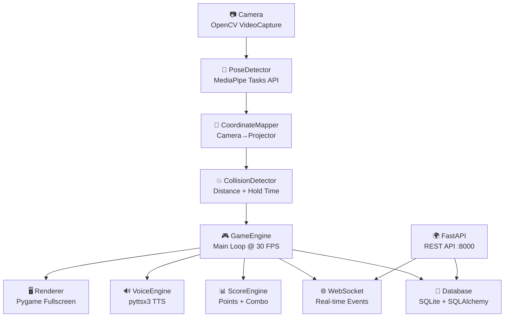

# Smart Wall Climbing — AI Engine Walkthrough

## Summary

Implementasi lengkap **AI Engine** untuk sistem Smart Wall Climbing berhasil dibuat dan disesuaikan untuk Python 3.14. Sistem ini terdiri dari 27 file dalam 7 komponen utama, siap digunakan untuk terapi interaktif wall climbing menggunakan Computer Vision.

---

## Architecture Overview



---

## Files Created (27 total)

### Project Setup
| File | Description |
|------|-------------|
| [requirements.txt](file:///d:/Informatika/Projekan/untitled_project/ai_engine/requirements.txt) | Python dependencies (pygame-ce for Python 3.14 compat) |
| [config.py](file:///d:/Informatika/Projekan/untitled_project/ai_engine/config.py) | Centralized configuration (camera, projector, game, colors, JWT) |
| [main.py](file:///d:/Informatika/Projekan/untitled_project/ai_engine/main.py) | Entry point with CLI flags (`--api-only`, `--windowed`, `--no-camera`) |

---

### Core AI Modules (`core/`)
| File | Description |
|------|-------------|
| [pose_detector.py](file:///d:/Informatika/Projekan/untitled_project/ai_engine/core/pose_detector.py) | MediaPipe Tasks PoseLandmarker tracking (hands, feet, skeleton) |
| [collision_detector.py](file:///d:/Informatika/Projekan/untitled_project/ai_engine/core/collision_detector.py) | Euclidean distance collision with hold-time validation |
| [voice_engine.py](file:///d:/Informatika/Projekan/untitled_project/ai_engine/core/voice_engine.py) | Threaded TTS (pyttsx3), bilingual EN/ID, rotating feedback |
| [stage_generator.py](file:///d:/Informatika/Projekan/untitled_project/ai_engine/core/stage_generator.py) | Random target placement with non-overlap constraints |
| [score_engine.py](file:///d:/Informatika/Projekan/untitled_project/ai_engine/core/score_engine.py) | Scoring with combo multiplier and time bonus |
| [analytics_engine.py](file:///d:/Informatika/Projekan/untitled_project/ai_engine/core/analytics_engine.py) | Progress trends (accuracy, reaction time, improvement %) |

---

### Game Engine (`game/`)
| File | Description |
|------|-------------|
| [engine.py](file:///d:/Informatika/Projekan/untitled_project/ai_engine/game/engine.py) | Main game loop: capture → detect → collide → score → render |
| [renderer.py](file:///d:/Informatika/Projekan/untitled_project/ai_engine/game/renderer.py) | Pygame rendering (pulsing targets, skeleton, HUD, particles) |
| [session_manager.py](file:///d:/Informatika/Projekan/untitled_project/ai_engine/game/session_manager.py) | Session state machine (IDLE→COUNTDOWN→PLAYING→PAUSED→FINISHED) |
| [modes/base_mode.py](file:///d:/Informatika/Projekan/untitled_project/ai_engine/game/modes/base_mode.py) | Abstract base class for game modes |
| [modes/number_game.py](file:///d:/Informatika/Projekan/untitled_project/ai_engine/game/modes/number_game.py) | Number Game with 3 stages (1→3 sequential targets) |

---

### Database (`db/`)
| File | Description |
|------|-------------|
| [database.py](file:///d:/Informatika/Projekan/untitled_project/ai_engine/db/database.py) | SQLite connection (async + sync engines) |
| [models.py](file:///d:/Informatika/Projekan/untitled_project/ai_engine/db/models.py) | ORM: User, Child, Game, Session, SessionResult |
| [crud.py](file:///d:/Informatika/Projekan/untitled_project/ai_engine/db/crud.py) | CRUD operations, analytics helpers, seed data |

---

### API Layer (`api/`)
| File | Description |
|------|-------------|
| [app.py](file:///d:/Informatika/Projekan/untitled_project/ai_engine/api/app.py) | FastAPI app with CORS, routers, lifecycle |
| [schemas.py](file:///d:/Informatika/Projekan/untitled_project/ai_engine/api/schemas.py) | Pydantic v2 request/response models |
| [dependencies.py](file:///d:/Informatika/Projekan/untitled_project/ai_engine/api/dependencies.py) | JWT auth + role-based access (Admin/Therapist) |
| [routes/auth.py](file:///d:/Informatika/Projekan/untitled_project/ai_engine/api/routes/auth.py) | `POST /api/login`, `POST /api/logout` |
| [routes/children.py](file:///d:/Informatika/Projekan/untitled_project/ai_engine/api/routes/children.py) | CRUD `/api/children` + progress endpoint |
| [routes/sessions.py](file:///d:/Informatika/Projekan/untitled_project/ai_engine/api/routes/sessions.py) | Start/pause/resume/end + history |
| [routes/games.py](file:///d:/Informatika/Projekan/untitled_project/ai_engine/api/routes/games.py) | List/create game configs |
| [websocket.py](file:///d:/Informatika/Projekan/untitled_project/ai_engine/api/websocket.py) | `ws://localhost:8000/ws/live` real-time events |

---

### Utilities (`utils/`)
| File | Description |
|------|-------------|
| [calibration.py](file:///d:/Informatika/Projekan/untitled_project/ai_engine/utils/calibration.py) | Camera→projector coordinate mapping (linear + homography) |
| [logger.py](file:///d:/Informatika/Projekan/untitled_project/ai_engine/utils/logger.py) | Centralized logging config |

---

## Verification & Compatibility Tweaks

Sistem telah diuji menggunakan **Python 3.14.3** dengan verifikasi sukses pada:
- **MediaPipe Tasks API**: Migrasi dari `mp.solutions.pose` legacy ke `Vision PoseLandmarker` dengan pengunduhan otomatis model `.task` Google.
- **Pygame-CE**: Menggunakan `pygame-ce` versi modern yang kompatibel penuh dengan Python 3.14.
- **FastAPI / Uvicorn Server**: Menjalankan API secara non-blocking di background thread.
- **SQLite Database**: Menghasilkan database otomatis di startup (`ai_engine/smart_wall_climbing.db`).
- **VoiceEngine**: Integrasi pengucapan multi-threaded menggunakan `pyttsx3`.

---

## How to Run

```bash
cd d:\Informatika\Projekan\untitled_project

# Jalankan dalam Windowed Mode (tidak Fullscreen) menggunakan Kamera & Game Loop
python -m ai_engine.main --windowed

# Jalankan hanya API server (untuk pengujian backend tanpa jendela game & kamera)
python -m ai_engine.main --api-only
```

### Default Login
- **Email**: `admin@smartwall.local`
- **Password**: `admin123`

### Keyboard Controls (saat game window aktif)
| Key | Action |
|-----|--------|
| `P` | Pause / Resume session |
| `S` | Stop session |
| `ESC` | Quit application |
